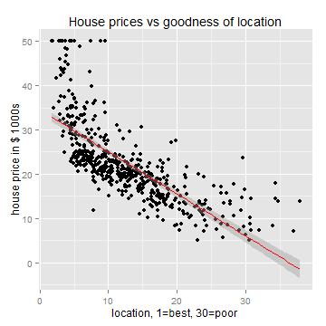
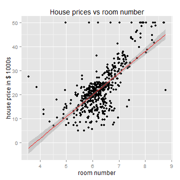
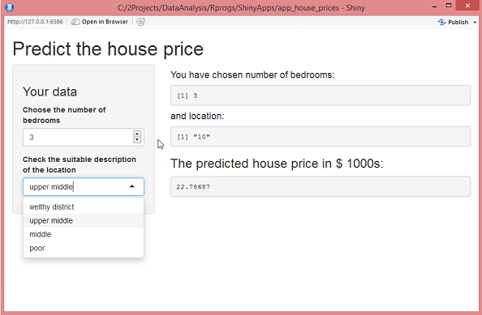

## App description

The presented app is very simple, it simulates the calculating of house price based on room number and location.

The user can select or change the number of bedrooms and the neighbarhood of the location in the left panel.

In the right panel the choices are presented again and the predicted house price appears below the title

--- .class #id 

## Data and modelling

For the model the Boston data set from the MASS package was used. It contains 14 features and 506 data sets. The features describe the size and age of the property objects as well as location, population and ecology.

The model uses only 2 features: room number and lstat - feature which describes the percentage of the lower status population. 

The motivation for that is that most statistical indexes are not handy for the user who just wants to enquire how much a house in different locations could cost. Instead the room number and the some idea of the goodness of the location are the first features to play with.

--- &twocol

## Data and modelling
The following 2 plots illustrate the correlation between the house price and selected features, so the model build on them should not be too bad and serve a purpose of this simple simulation.

*** =left

*** =right

--- .class #id 

## Showing app

The location has to be estimated by user. There are 4 kinds of possible choices: welthy district, upper middle, middle and poor. This choices are heuristically turned into the values for lstat. 

The submit button was refused to make playing with the app easier.

Here is the print screen of the app:

